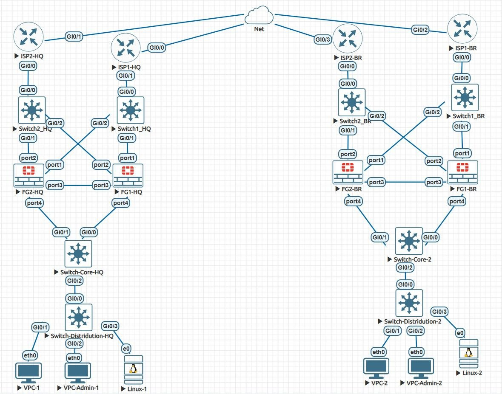

# Multi-Site-FortiGate-Deployment
# EVE-NG FortiOS 7.2.0 — Multi-Site Lab Documentation

> **Course Project** · Egypt-Japan University of Science and Technology (E-JUST)  
> **Subject:** Computer and Network Security (CNC 323)  
> **Instructor:** Dr. Ismail Abdelkader

---

## Project Overview

This repository documents a complete **multi-site FortiGate network security lab** built on the EVE-NG virtualisation platform. The lab simulates a real-world enterprise deployment across two sites (HQ and Branch), covering advanced Fortinet technologies including High Availability, IPsec VPN, SD-WAN, and UTM security profiles.

---

## 🏗️ Lab Topology



### Sites
| Site | Devices | LAN Network |
|---|---|---|
| **HQ (Headquarters)** | FG1-HQ, FG2-HQ, ISP1-HQ, ISP2-HQ, Switch-Core-HQ, Switch-Distridution-HQ, VPC-1, VPC-Admin-1, Linux-1 | 192.168.10.0/24 |
| **BR (Branch)** | FG1-BR, FG2-BR, ISP1-BR, ISP2-BR, Switch-Core-2, Switch-Distridution-2, VPC-2, VPC-Admin-2, Linux-2 | 192.168.20.0/24 |

### IP Addressing Plan
| Site | Interface | IP Address | Purpose |
|---|---|---|---|
| HQ | port1 | 172.16.11.2/30 | WAN1 (ISP1) |
| HQ | port2 | 172.16.12.2/30 | WAN2 (ISP2) |
| HQ | port4 | 192.168.10.1/24 | LAN Gateway |
| BR | port1 | 172.16.21.2/30 | WAN1 (ISP1) |
| BR | port2 | 172.16.22.2/30 | WAN2 (ISP2) |
| BR | port4 | 192.168.20.1/24 | LAN Gateway |

---

## 🛠️ Technologies Implemented

| Technology | Standard / Version | Description |
|---|---|---|
| **High Availability** | Active-Passive (A-P) | Redundant FortiGate pair at each site |
| **IPsec VPN** | IKEv2 · AES256-SHA256 · DH14 | Dual redundant site-to-site tunnels |
| **SD-WAN** | FortiOS SD-WAN | WAN underlay + VPN overlay zones |
| **Firewall Authentication** | Local DB | Captive portal for web traffic |
| **Antivirus** | Flow-based (LAB-AV) | HTTP/FTP malware scanning |
| **Web Filter** | URL Filter (LAB-WEB) | Domain-based access control |
| **FortiOS** | 7.2.0 | Applied across all 4 FortiGate VMs |
| **EVE-NG** | Pro / Community | Network virtualisation platform |

---


## ⚙️ Configuration Highlights

### High Availability
Both sites use **Active-Passive HA** with:
- **port3** as the HA heartbeat link
- **port4** as the monitored interface (triggers failover if LAN link drops)
- `override enable` so the higher-priority unit always reclaims primary role
- Session pickup enabled for seamless failover

### IPsec VPN
Four tunnels provide full redundancy:
```
HQ-BR-WAN1  →  port1 (HQ) ↔ port1 (BR)  [172.16.11.x ↔ 172.16.21.x]
HQ-BR-WAN2  →  port2 (HQ) ↔ port2 (BR)  [172.16.12.x ↔ 172.16.22.x]
```

### SD-WAN Zones
| Zone | Type | Members |
|---|---|---|
| `WAN-UNDERLAY` | WAN | port1, port2 |
| `VPN-OVERLAY` | Overlay | HQ-BR-WAN1, HQ-BR-WAN2 |

Traffic to the Branch prefers the VPN overlay (SD-WAN service priority 11, 12) while internet traffic exits via the WAN underlay (priority 1, 2).

### Security Profiles
- **LAB-AV**: Flow-based antivirus blocking HTTP/FTP malware (tested with EICAR)
- **LAB-WEB**: URL filter table 100 blocking `blocked.lab`, permitting `allowed.lab`
- Both profiles attached to the web authentication policy (`HQ-BR-WEB-AUTH-UTM`)

---

## 📸 Lab Evidence (Proof of Work)

### Infrastructure Verification Screenshots

| Screenshot | What it proves |
|---|---|
| `ISP1_HQ_verification.jpg` | ISP1-HQ has route to BR WAN1 subnet; pings to 10.255.0.21 and 172.16.21.1 succeed (100%) |
| `ISP2_HQ_verification.jpg` | ISP2-HQ has route to BR WAN2 subnet; pings to ISP2-BR and FG1-BR port2 (172.16.22.2) succeed |
| `VPC_Admin1_HQ_LAN_verification.jpg` | VPC-Admin-1 reaches all HQ LAN hosts and the FortiGate gateway; BR unreachable (VPN pending — expected) |
| `VPC1_HQ_LAN_verification.jpg` | VPC-1 reaches all HQ LAN hosts; BR unreachable (VPN pending — expected) |

> **Note on "Destination network unreachable":** The ICMP type:3 code:0 responses for Branch addresses (192.168.20.x) originate from the **FortiGate at 192.168.10.1**, not from a broken link. This confirms the HQ infrastructure is fully operational — the FortiGate is the correct gateway but has no route to the Branch until the IPsec VPN tunnels are configured (Section 9 of the documentation).

---

## ✅ Testing Scenarios Summary

| Test | Objective | Status |
|---|---|---|
| HA Failover | Verify FG2 becomes primary when FG1 port4 goes down | ✅ Documented |
| VPN Connectivity | Ping between HQ and BR over IPsec tunnels | ✅ Documented |
| SD-WAN Failover | Traffic shifts to WAN2 VPN when WAN1 fails | ✅ Documented |
| Firewall Authentication | Users must authenticate via captive portal for HTTP | ✅ Documented |
| Antivirus Blocking | EICAR test file download blocked | ✅ Documented |
| Web Filter Blocking | blocked.lab access denied; allowed.lab accessible | ✅ Documented |

---

## 🔧 Prerequisites (to reproduce this lab)

- **EVE-NG** Community or Pro (Ubuntu 20.04 base)
- **FortiGate-VM64-KVM.vmdk** — FortiOS 7.2.0 (valid eval or licensed)
- **Cisco IOSv** 15.x (routers — 4 instances)
- **Cisco IOSvL2** 15.x (switches — 6 instances)
- **VPCS** latest (4 instances)
- **Slax Linux** latest (2 instances)
- Minimum host: 32 GB RAM, 250 GB SSD, CPU with VT-x/AMD-V

---

## 📚 Documentation

The full technical documentation (29 pages) covers:

1. Executive Summary
2. Lab Topology Overview
3. Hardware & Software Requirements
4. Pre-Configuration Checklist
5. Infrastructure Configuration (switches & ISP routers)
6. FortiGate HA Configuration
7. FortiGate Network Configuration
8. Security Profiles
9. VPN Configuration
10. SD-WAN Configuration
11. Firewall Policies
12. Verification Procedures
13. Testing Scenarios
14. Troubleshooting Guide
15. Maintenance Procedures
16. Appendices
17. Lab Evidence – Proof of Work

📄 See [`docs/EVE_NG_FortiOS_7_2_0_Documentation.docx`](docs/EVE_NG_FortiOS_7_2_0_Documentation.docx)

---

## 📖 Key References

- [Fortinet Documentation Library](https://docs.fortinet.com/)
- [FortiOS 7.2 Administration Guide](https://docs.fortinet.com/product/fortigate/7.2)
- [EVE-NG Documentation](https://www.eve-ng.net/index.php/documentation/)
- [Fortinet NSE Training](https://training.fortinet.com/)

---


*E-JUST · Computer and Network Security Department · 2026*
